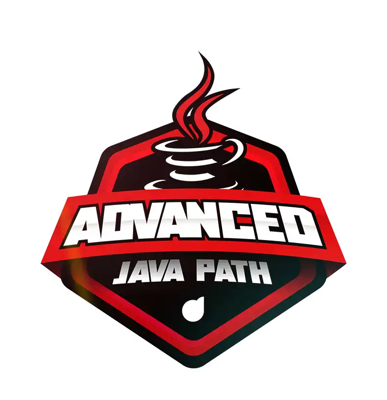

<h1 align="center">
  Aceleração Internacional para Profissionais de Tecnologia - Advanced Java Path
</h1>

  

<h2 align="center">
  
</h2>

  <a href="#-projeto">🖥️ Projeto</a>&nbsp;&nbsp;&nbsp;|&nbsp;&nbsp;&nbsp;
  <a href="#-tecnologias">🚀 Tecnologias</a>&nbsp;&nbsp;&nbsp;|&nbsp;&nbsp;&nbsp;
  <a href="#-license">📝 License</a>

## 💻 Projeto

Repositório criado para os desafios de códigos da "Aceleração Internacional para Profissionais de Tecnologia - Advanced Java Path" da DIO.

## 🚀 Tecnologias

Esse projeto foi desenvolvido com as seguintes tecnologias:

    

## 📝 License

Esse projeto está sob a licença MIT. Veja o arquivo [LICENSE](LICENSE) para mais detalhes.

---

## 📚 Questionário

- Questionário [veja aqui](./questions/questions.md)

## 📚 Lista dos Desafios

- Leap Year? [veja aqui](./desafio1/LeapYear.java)
- Difference Between Digits [veja aqui](./desafio2/DifferenceBetweenDigits.java)
